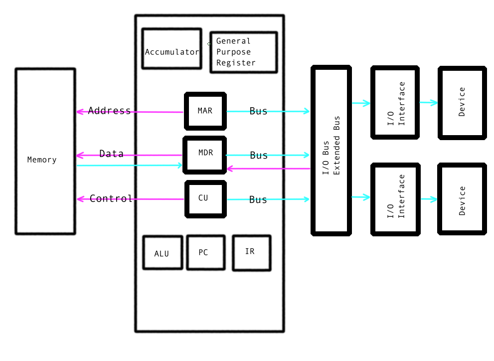
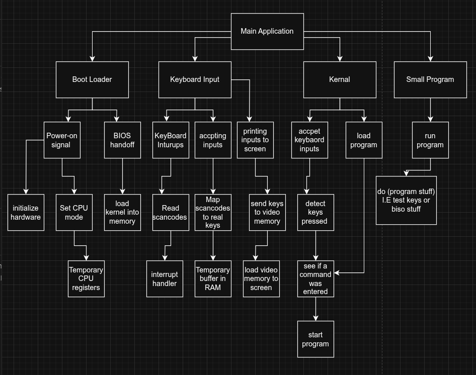

# NEA (Non Exam Assessment) - Designing a ISO image in low level languages to assess the state of computers

---
mainfont: "DejaVu Serif"
fontsize: 10pt
geometry: margin=0.7in   # smaller margins to fit wide tables
header-includes:
  - \usepackage{graphicx}        # for images
  - \usepackage{longtable}       # tables that can span pages
  - \usepackage{tabularx}        # tables with flexible column widths
  - \usepackage{float}           # for [H] placement
  - \usepackage{pifont}          # for \ding
  - \usepackage{fancyhdr}        # for headers
  - \pagestyle{fancy}            # use fancy page style
  - \lhead{Designing a ISO image in low level languages to assess the state of computers}  # Left header text with line breaks
  - \rhead{\thepage}             # Right header text (page number)
---


------------------------------------------------------------------------

# Full documentation

------------------------------------------------------------------------


# Candidate Code Skills Cover Sheet
**NEA skills used in code**


\begin{longtable}{|l|p{9cm}|p{5cm}|l|}
\hline
\textbf{Group} & \textbf{Model} & \textbf{Can be found in} & \textbf{Page No.} \\ \hline

A & Low-level hardware interaction (direct port I/O, memory-mapped I/O) & inb function, keyboard input handling, VGA buffer access (print.c, main.c) & 62 - 63, 67 - 68 \\ \hline

A & Memory management model (paging, segmentation, stack setup) & Page table creation and enabling paging (main.asm) & 58-59 \\ \hline

A & CPU mode switching / architecture control (32-bit to 64-bit transition) & Long mode setup and jump to 64-bit kernel (main.asm, main64.asm) & 57 and 59 \\ \hline

A & Interrupt-style input handling (continuous hardware polling loop) & read\_scancodes loop handling keyboard input (main.c) & 67-68 \\ \hline

A & Modular kernel architecture & Separation of kernel, keyboard, and display subsystems & 55 - 70 \\ \hline

A & Custom command-line interface model & Command parsing and execution system (main.c) & 65 - 68 \\ \hline

B & Data structures for lookup and buffering & Scancode lookup table and command buffer arrays (keyboard.c, main.c) & 60 - 61 and 67 - 68 \\ \hline

B & Structured data types (records/structs) & Struct Char for screen buffer representation (print.c) & 62 \\ \hline

B & Sequential data processing & Continuous keyboard input stream processing (main.c) & 64 - 68 \\ \hline

B & String processing system & Manual string comparison and manipulation (main.c) & 65 \\ \hline

B & Mathematical processing & Integer handling and ALU test (test\_program.c) & 64 \\ \hline

C & Single-dimensional arrays & Command buffer and keymap arrays & 64 and 68 \\ \hline

C & Primitive data types & Use of fixed-width integers (uint8\_t, uint16\_t, uint32\_t) & 55 - 56 \\ \hline

C & Basic input/output system & Character-by-character screen output functions (print.c) & 62 - 63 \\ \hline

\end{longtable}


CODING STYLE EXAMPLES

\begin{longtable}{|l|p{8cm}|p{5cm}|l|}
\hline
\textbf{Coding Style} & \textbf{Characteristic} & \textbf{Can be found in} & \textbf{Page No.} \\ \hline
Excellent & Modules (subroutines) with appropriate interfaces & main.c, keyboard.c, print.c, test\_program.c & 60 and 62 and 64 \\ \hline
 & Good exception handling & main.asm (error routine), main64.asm & 57 - 59 \\ \hline
 & Loosely coupled modules – module interacts with others via interface only & keyboard.c, print.c, main.c & 60 and 62 and 64 \\ \hline
 & Cohesive modules – module code does just one thing & print.c, keyboard.c, test\_program.c & 60 and 62 and 64 \\ \hline
 & Modules – subroutines with common purpose grouped & print.c (screen output), keyboard.c (input handling) &  \\ \hline
 & Defensive programming & keyboard.c (lookup\_key validation), main.asm (CPU/multiboot checks) &  \\ \hline
Good & Well-designed user interface & main.c (command-line interface) &  \\ \hline
 & Modularisation of code & main.c, print.c, keyboard.c, test\_program.c &  \\ \hline
 & Good use of local variables & print.c, main.c &  \\ \hline
 & Minimal use of global variables & print.c, keyboard.c &  \\ \hline
 & Managed casting of types & print.c, main.c &  \\ \hline
 & Appropriate indentation & all .c and .asm files &  \\ \hline
 & Self-documenting code & all .c and .asm files &  \\ \hline
 & Consistent style throughout & all .c and .asm files &  \\ \hline
 & File paths parameterised & Makefile (source discovery), main.c (color lookup) &  \\ \hline
 & Use of constants & print.h, main.c, keyboard.c &  \\ \hline
Basic & Meaningful identifier names & all .c and .asm files &  \\ \hline
 & Annotation used effectively where required & print.c, keyboard.c, main.asm &  \\ \hline
\end{longtable}


# ANALYSIS Section

## The problem:

Currently there is no super-fast, super-efficient minimal OS system
which can be used by low level programmers or system administrators in
testing boot speed of old computers. This is especially problematic for
small organisations such as North_Devon_Computing due
to issues when testing the bios or main OS systems. In these instances,
it is good to have a temporary live environment to boot quickly and
ensuring the computer which is being repaired is not experiencing
problems with the bios or initial booting.
North_Devon_Computing is a relatively small company
with only 4 employees Daron (the boss), Michael, Julie and Sam Jacobson. Sam is the only low level programmer employed and
due to this fact, he is in charge of ensuring that computers for repair
are not experiencing low level booting issues. Poor Sam cannot use a
pre-existing mainstream operating systems such as Ubuntu or Windows PE
because these OS' are very large and run slowly on older machines. When
the company first started they were only servicing 1 PC per day and were able to get them in and out in quickly. However North_Devon_Computing is now getting
many old computers to repair, daily, due to a recent power surge in the
area. Sam has many computers waiting to be repaired, that all may
have booting issues It is imperative that he find a faster method to
quickly test all of these computers.

## Background

The organisation in this project is called
North_Devon_Computing. It is a small computer repair
business that specialises in diagnosing and fixing hardware and software
problems in desktop PCs and laptops. The company is based in a local
community that has recently suffered from a major power surge, resulting
in a sudden increase in damaged or non-booting computers.

The business has only four employees:

    Daron (the boss) – Oversees the business and handles customer service

    Michael – General technician

    Julie – General technician

    Sam – Low-level systems programmer

Due to the recent increase in demand, the team now receives many more
machines per day---some of which may have BIOS-level faults or other
early boot problems.

Sam is responsible for identifying whether each incoming computer can
successfully power on, reach the BIOS, and begin the boot process.

However, this is currently slow and inefficient, because there is no
ultra- lightweight, high-speed, minimal operating system that can boot
quickly enough to verify that a system is functioning at a basic level.

Existing operating systems such as Ubuntu or Windows PE are too slow to
boot in this quick paced environment, and many of these damaged systems
may not have the resources to support them. When the company only
received one PC a day, this was manageable. But now Sam is
overwhelmed, and the company is losing both money and clients.

The goal of this project is to create a custom minimal OS, designed to
boot quickly and give immediate feedback as to whether a computer is
functioning at a low level. This would allow Sam (the project's main
contact) to rapidly triage incoming machines and prioritise repairs.

## Description of Current System

At the moment Sam is using a lightweight version of ubuntu called
Xubuntu which runs minimal software and uses Xfce for the GUI to further
decrease processing power. However, from Sam's own experience and the
general consensus from online forums the boot time for Xubuntu can be
slow. There was even one forum user saying it could take as long as 4
minutes and according to another source:

"boot time was never less than 30 seconds always between 30‑50
seconds"\~
https://itsfoss.community/t/linux-boot-time-is-more-than-windows-boot-
time-on-old-laptop-pc/7343/1 a comment made by user Mohit Bora

This a task that should be taking Sam at most 20 seconds and is taking
him sometimes 4+ minutes. This is clearly a waste of time in Daron's
eyes. The current system: Xubuntu is a Linux distribution based off of Ubuntu
which initially worked well as it was eashy for Sam to flash the Xubuntu ISO on to a USB flash drive. It is also a freely available tool with many systems and pre-built commands that help
with other testing aspects later in the repair. In my project I will not
be able to tackle all of the issues with respect to later system
testing. This may require some of the tools with Xubuntu. However, I
believe that I will be able to test if a system has BIOS problems and
early on booting problems. It will also test if the computer can run a
simple program or if there are I/O problems.

Recap of problems I hope to solve:

      speeding up testing

      checking for BIOS problems  

      checking for early stage problems 

      checking for I/O problems  

      checking for ability to run simple scripts/programs

## Identification of User and Users needs and acceptable limitations

The main user of my project will be low level system programmers and
computer repair shop workers. The UI may be unfriendly to
the average computer user and many people simply would not
have the use cases necessary to go through the effort of installing an
OS. Only one person should be be using an instance of the OS at a time, as this is effectively a testing ground for technicians. There is no
need for there to be instance of multiple users on the OS which should
mean that it is easier to programme. Specifically I will not need a databases
stored in memory of each user on the OS.

I believe the needs of the user are very simple, to establish an OS that
an user can boot into from a USB. This will be used to test basic functionality of the
system. You will be able to ensure the BIOS correctly initiates the early booting stage and that the keyboard keys are 
all work correctly. I did a Q&A with Sam, asking all the important question to ensure I correctly identified all the metrics he required. 
Here is a
transcription of the core parts of our conversation (I asked the
questions and Sam answered them)

Q: What is your need for this Operating system?\
A: The company I work at (the computer repair shop) needs me to
test computers to ensure that there are no booting or I/O device
issues. If these issues are present it will need to identifying specifically what they consist of.

Q: Do you already have a system in place to find deal with this issue\
A: Yes we do actually but it runs poorly. It is slow to boot has way to
bloated for the testing I. I end up spending like at least 1
minute waiting for the device to boot up and only then can I begin testing what I need to test.

Q: What features or tools do you absolutely need the OS to have to make
your job easier?\
A: Yes a number of tools on the OS are essential for me. I really need to have
programs I can run to easily to check the the keyboard inputs and maybe a
basic calculator program to check the CPU registers like the ALU
(arithmetic logic unit)

Q: Are there any specific hardware components or brands that the OS must
support or be compatible with?\
A: there is the OS must be programmed to deal with specificity x86
architecture for computers and laptops we get in the shop.

Q: How important is the boot speed of the OS to you? What is an
acceptable maximum boot time?\
A: Boot speed is very important. I need it to boot in under a maximum of 1 minute but 
ideally under 10 seconds. This would be so much faster than the
current boot time of my Xubuntu OS that can take 4 minutes

Q: How would you prefer to navigate and interact with the OS? Command
line, graphical interface, or both?\
A: Well a GUI would be nice but if it gets in the way of boot time then
a CLI will be fine as all i am doing a some quick testing for each
machine

Q: Are there any common issues or errors you encounter frequently during
testing that you want the OS to help diagnose automatically?\
A: Yes it would be very cool if there was a program i could load up to identify which keys are not working. A diagnostic test on all the keys of laptops would be perfect, if it tells me which specific keys that do not work.

Q: Would you require the OS to save any logs or test results? If yes,
how should these be accessed or stored?\
A: No there is no need for the OS to save any files. Ideally i would like
the OS to kind of just wipe itself clean so I do not have to re-flash it
to the USB every single time.

Q: What limitations would you find acceptable in this OS? For example,
lack of multi-user support or limited software?\
A: i would find it acceptable to have no: GUI, Memory management or
multi-user support.

Q: How important is portability for this OS? Should it work on as many
different machines as possible, or just a specific set?\
A: Portability is extremely important for this OS I need it run across
as many machines as possible to ensure maximum coverage of our services
to all.

Q: How would you rate your technical skill level and comfort with
installing and using a custom OS from USB?\
A: I would say my technical skills are quite high up for the average IT
technician and as i said before have installed OS's to new computers
many times.

Q: What is the most frustrating part of your current testing process
that you want this OS to fix?\
A: The time. there is nothing more frustrating in this job than the boot
time for Xubuntu as i have to wait for so long doing nothing when I
could be moving on to the next PC or Laptop

Q: Would you like the OS to have any diagnostic visualization (e.g.,
showing keyboard inputs, BIOS messages)?\
A: It would be preferable to display some sort of pop up on a GUI or a
little message in the CLI outputting a BIOS message or showing the
keyboard inputs (maybe the program for testing the keys like I said
before)

Q: Are there any security concerns or precautions you want for this OS,
given it might be used on multiple potentially faulty machines?\
A: As long as the OS is not recording everything a user does or installs
malware to the BIOS I would be happy. In the past it has proven extremely difficult to get rid of malware from some programmes. I do not
think there is a problem with security as we will not be entering any
user specific information when in the OS. We also unplug the clients hard drive or ssd just after turning 
on the computer. This is to ensure no client data is accessed or destroyed.

## Data Source and Volumes

How the data needs to flow!

This project has particular needs that must be met for instance,
the OS must be able to read keyboard inputs and be able to display them
to the screen. Each typed letter is displayed to the screen which is the main input to the program. The amount
of data entered will vary from machine to machine. However, from
preliminary research I believe that there will be an average of 100 key
strokes per use of this program. As I previously stated, the way programs are
entered into this program is through the keyboard. The most common outputs for the system will be similar to the following:

    Testing BIOS 20%  

    Testing BIOS 50%  

    Testing BIOS 100% Done BIOS good!

    Testing keyboard ...

The final file size for this project (final build of the ISO) should around 100 MB for fast load speeds.

## Modelling (Data Dictionary, ERD, data flow, etc.)

(data flow chart)

\begin{figure}[H]
\centering
\includegraphics[width=0.8\textwidth]{images/dfd_1.png}
\end{figure}

(data flow chart) 1


\begin{figure}[H]
\centering
\includegraphics[width=0.8\textwidth]{images/dfd_2.png}
\end{figure}

(data flow chart) 2

\begin{figure}[H]
\centering
\includegraphics[width=0.8\textwidth]{images/dfd_3.png}
\end{figure}

(data flow chart) 3

\begin{figure}[H]
\centering
\includegraphics[width=0.8\textwidth]{images/dfd_4.png}
\end{figure}

(data flow chart) 4

\begin{figure}[H]
\centering
\includegraphics[width=0.8\textwidth]{images/dfd_OS.png}
\end{figure}

(data flow chart) 5

object--analysis diagram - unnecessary as no object orientated programming used

initial design idea:


{.H}


Above you can see my idea for the initial design, as you can see it is
very basic. It is a CLI (command line interface) and may well 
look very much like my final design. It follows all of my basic
requirements: allows inputs and outputs and shows the boot time and
result of the BIOS check.


{.H}


-----------


## Alternative systems

When reviewing light weight os systems it is not difficult to see
a multitude of distributions which Linux developed for such a problem. However,
all the solutions I have researched were not suitable for this
business. This was due to a multitude of reasons. 
I will now outline the top 3 that I would consider for this business over the project I am developing:

### Tiny Core Linux

Tiny Core Linux is super small and light weight, meaning the file size is extremely small and as long as you are using reasonable hardware it boots quickly. However, it takes much longer on older hardware because it boots a full Linux kernel and requires additional set up to use diagnostic tools such as BIOS check and I/O testing. 
My OS fixes this by not booting a Linux kernel but instead booting my own custom kernel that will also have inbuilt diagnostic tools instead of having to install them after you have booted.

### SystemRescue (SystemRescueCD)

Systems rescue OS is an amazing OS for testing computers, finding and then
fixing issues that computer may have. However it's ISO is much lager in
file size due too additional tools which hinders the OS's ability to boot as fast as possible. The additional software (bloat) is a problem that my OS solves by not including the unnecessary software and having only basic testing software. This will minimise boot times and to ensure that there is a simple way to access the limited tools needed.

### KolibriOS

KolibriOS is a tiny super light weight OS with a gui and many other
great pre loaded programs. However, it only works on 32 bit machines with
legacy boot so machines that operate on UEFI booting would not be supported. The amount of additional programs is also a draw back for boot time compared to my proposed OS. 

## Objectives and Requirements

Specific: objectives should specify exactly what they want to achieve.

Measurable: it should be possible to measure whether the objectives are
met or not.

Achievable: the objectives should be achievable.

Realistic: the objectives should be realistically achieved with the
resources available.

Timed: there should be a set time given to achieve the objectives.

  ----------------------------------------------------------------------------
  Specific          Measurable        Achievable/Realistic   Timed
  objective                                                  
  ----------------- ----------------- ---------------------- -----------------
  boot from x86     test OS on        yes should be          must be completed
  architectures     different         achievable using vim   before end of
                    architectures     and c and ASM          2025 so i can
                    (PC) when done                           implement in 2026

  test keyboard     press keyboard on yes should be          must be completed
  inputs            instance od the   achievable using vim   before end of
                    OS see if it      and c and ASM          2025 so i can
                    displays it                              implement in 2026
                    
  ----------------------------------------------------------------------------

  ---------------------------------------------------------------------------
  Numbered       Specific        Measurable     Functional or  Timed
                 objective                      non functional 
  -------------- --------------- -------------- -------------- --------------
  1              Boots onto a    test on a      functional     
                 computer        computer to                   
                                 see if it                     
                                 boots                         

  2              test I/O        test with      functional     
                                 keyboard once                 
                                 programs boot                 

  3              runs simple     enter command  functional     
                 program         when done                     

  4              boot time \<    time how long  non functional 
                 10S             takes to boot                 

  5              OS size (ISO    looks at iso   non functional 
                 file size) \<   file size                     
                 100 MB                                        

  6              runs on 64 bit  test on a 64   non functional 
                 architecture.   bit computer                  
                 
  ---------------------------------------------------------------------------

# Design Section

## General Overview

This project will be developed in C and ASM mainly with other necessary
build files (I.E makefiles). None of these are object-orientated languages therefore it is inappropriate to be using any object orientated programming in these procedural languages. The system will need to talk directly to hardware and I will use ASM to accomplish this. This system will be able to power on and then accept keyboard input.

## IPSO chart (Input, Process, Storage, Output)

  -------------------------------------------------------------------------
  Input           Process             Storage             Output
  --------------- ------------------- ------------------- -----------------
  Power on / BIOS Bootloader loads    Kernel stored in    CLI "Booting
                  kernel into memory  RAM                 Minimal OS"

  User keystrokes Kernel interprets   Temporary memory    Displayed
                  key codes via       buffer              characters on
                  interrupt handlers                      screen

  Diagnostic      Program executes    Registers used      CPU check passed
  command (e.g.,  arithmetic logic    temporarily         
  `TCPU`)         unit checks                             

  Diagnostic      Program maps each   No permanent        Missing/working
  command (e.g.,  keystroke against   storage             keys list
  `TKeyboard`)    expected input                          

  Exit / Shutdown Kernel halts CPU    Clears buffer       System Shutdown
  command       
                                            
  -------------------------------------------------------------------------

## Modular design

Modular design comments When designing system split into smaller
components

This is a breakdown diagram of the essential functions of each of my
main systems:

{.H}

The OS will be developed as a collection of smaller, independent modules
that can be tested and maintained separately.

-   **Bootloader Module** -- Sets up CPU mode, loads kernel into
    memory.\
-   **Kernel Module** -- Handles interrupts, manages memory and I/O.\
-   **CLI Module** -- Provides command-line interface for user
    interaction.\
-   **Keyboard Diagnostic Module** -- Captures keystrokes and checks
    against expected inputs.\
-   **CPU Diagnostic Module** -- Runs arithmetic tests on ALU and
    verifies results.\
-   **Shutdown/Halt Module** -- Provides a safe exit point from the OS.

This modular approach reduces complexity and makes the system more
robust.

------------------------------------------------------------------------

## Form / Navigation Design

Form/Navigation Design

Navigation is text-based, using a simple CLI for commands.

**Workflow:**

Boot → CLI menu → Run Diagnostic (keyboard/CPU) → Display Results →
Option to Shutdown

**Example Commands:**

-   `test_keyboard` = Runs keyboard input diagnostic.\
-   `test_cpu` = Runs CPU arithmetic test.\
-   `help` = Lists available commands.\
-   `halt` = Shuts down the OS.

------------------------------------------------------------------------

## Code Base

Code Base

The OS will be coded in **C** and **Assembly**, with a structured
directory:

/src /boot → Bootloader (Assembly) /kernel → Core kernel (C/ASM)
/drivers → Keyboard and screen drivers /diag → Diagnostic programs
/build → ISO build scripts

-   **Bootloader** written in Assembly (NASM).\
-   **Kernel and diagnostics** written in C with some inline Assembly.\
-   **Makefiles** used to automate compilation and ISO building.

------------------------------------------------------------------------

## Data Dictionary

  Data Item       Type     Description                       Example
  --------------- -------- --------------------------------- ------------------
  `keystroke`     char     Single keyboard input value       `'A'`, `'Enter'`
  `cpu_result`    int      Stores result of CPU diagnostic   `1 (pass)`
  `cli_command`   string   User-entered command              `"test_cpu"`
  `boot_status`   bool     BIOS/boot status                  `true` / `false`
  `buffer`        array    Temporary keystroke storage       `['a','b','c']`

------------------------------------------------------------------------

## Validation Required

-   **Command validation** -- Only recognised commands are executed.\
-   **Keyboard validation** -- Keystrokes must match expected layout.\
-   **CPU test validation** -- Arithmetic operations compared with
    expected results.

------------------------------------------------------------------------

## Algorithms

### Boot Sequence

BEGIN Power on Load bootloader Bootloader loads kernel into memory
Switch to protected mode Start kernel Display "Booting Minimal OS..."
END

### Command Handling

READ input IF input = "test_keyboard" THEN run keyboard test ELSE IF
input = "test_cpu" THEN run CPU test ELSE IF input = "help" THEN display
command list ELSE IF input = "halt" THEN shutdown system ELSE display
"Invalid command"

### Keyboard Diagnostic

FOR each key in layout IF key pressed THEN mark "working" ELSE mark
"missing" DISPLAY results

------------------------------------------------------------------------

## Object-Oriented Programming (OOP)

Even though the OS is written in C and Assembly (non-OOP languages),
design principles can still be applied:

-   **Bootloader** -- Attributes: memory location, CPU mode \| Methods:
    load kernel, jump.\
-   **Kernel** -- Attributes: memory map, interrupts \| Methods: manage
    hardware, run commands.\
-   **Keyboard** -- Attributes: key codes \| Methods: capture, display
    input.\
-   **Diagnostic Program** -- Attributes: name, test type \| Methods:
    execute test, show result.\
-   **User** -- Attributes: entered command \| Methods: interact via
    CLI.

------------------------------------------------------------------------

## Trace Tables & Testing Strategies

trace tables testing strategy

### Example Trace Table -- Keyboard Diagnostic

  Step   Input              Expected Output   Actual Output   Pass/Fail
  ------ ------------------ ----------------- --------------- -----------
  1      Press `A`          `A` displayed     `A` displayed   Pass
  2      Press `Enter`      New line          New line        Pass
  3      Press `Shift+Q`    `Q` displayed     `Q` displayed   Pass
  4      Press broken key   Missing shown     Missing shown   Pass

### Testing Strategies

-   **Unit Testing** -- Test each module separately (bootloader, kernel,
    diagnostics).\
-   **Integration Testing** -- Combine modules to ensure correct
    interaction.\
-   **System Testing** -- Test entire OS on emulated and physical
    machines.\
-   **Performance Testing** -- Measure boot speed (\<10s target).\
-   **Validation Testing** -- Check inputs/commands behave as expected.

------------------------------------------------------------------------

Design

see ipso chart

IPSO Chart (Input, Process, Storage, Output) Input Process Storage
Output Power on / BIOS handoff Bootloader loads kernel into memory
Kernel stored in RAM CLI message: "Booting Minimal OS..." 
User keystrokes Kernel interprets key codes via interrupt handlers Temporary
memory buffer Displayed characters on screen Diagnostic command (e.g.,
test_cpu) 
Program executes arithmetic logic unit checks Registers used
temporarily CLI output: "CPU check passed" Diagnostic command (e.g.,
test_keyboard) 
Program maps each keystroke against expected input No
permanent storage CLI output: Missing/working keys list Exit / Shutdown
command Kernel halts CPU Clears buffer CLI message: "System halted"

# Technical solution

## Explanation of system as a whole

The system as a whole works by initially using GRUB to load the Multiboot header in my header.asm file. It is this Multiboot header which contains important data required for the booting process. It does this by reading the Multiboot magic number (0x36d76289), which is located in the Multiboot header. It then proceeds to pass control to the bootloader.

The bootloader is the code I wrote in ASM. It is the job of this code to initialize the system. As the code starts to run, it switches to 32-bit protected mode. At this point I can start to perform advanced checks on the system, including checking for features such as memory protection.

At the same time it proceeds to perform register checks to ensure the hardware is capable of running 64-bit long mode. This is done by checking the CPU to ensure flags such as the long mode flag in the CPU's EFER (Extended Feature Enable Register).

After this has been done, it then completes the rest of the steps necessary to jump to long mode. The most important aspect here is enabling paging.  This means setting up PML4 (Page Map Level 4) tables, configuring CR3 to point to the Page Directory Pointer Table, and modifying CR0 to enable paging. Once these steps have been completed, EFLAGS register is set and the system can finally jump to long mode

Once transitioned to long mode, and provided there were no problems, it will load the kernel and display the start up text to the screen via VGA text mode for the x86_64 architecture.
 
As all these components are loaded, and text output rendering is done, the system initializes its background processes, which include threading and polling. This enables it to carry out tasks such as showing key presses on the screen, as well as other processes in the background, such as executing programs.

## code layout

    OS-build  

    ├── Makefile  
    ├── source  
        ├── colours  
            └── print.h  
        └── impl  
            ├── kernel  
            │   └── main.c  
            └── x86_64  
                ├── print.c    
                ├── keyboard.c   
                ├── test_program.c 
                └── boot  
                    ├── header.asm  
                    ├── main.asm  
                    └── main64.asm  
    ├── targets-x86_64  
        ├── linker.ld  
        └── boot  
            ├── kernel.bin  
            └── grub  
                └── grub.cfg  
    └── distribution-x86_64  
        ├── kernel.bin  
        └── kernel.iso 

## Parts I am most proud of

### System Boot & Architecture

(Assembly + Paging + Long Mode)

What it does

This part of the project is responsible for:
- Booting the Operating System
- Checking for compatibility
- conversion from 32-bit protection mode to 64-bit long mode
- Enabling memory management
- Jumping into 64-bit mode

This is handled primarily in:
- header.asm
- main.asm
- main64.asm
- linker.ld
How it works

#### 1 Multiboot Header (header.asm)

Here is where we create the Multiboot2 header to the kernel, without this the GRUB won’t be able to boot the kernel.

The Multiboot header is made up of:
- Magic number
- Architecture type
- Header length
- Checksum
- End tag

#### 2 CPU & Compatibility Checks (main.asm)

For 64-bit mode transition, I need to check a few things first.
- The Operating System boots correctly (check_mb)
- The CPU supports CPUID (check_cpu)
- The CPU supports 64-bit mode (check_long)

For instance:
```
mov eax, 0x80000001  
cpuid  
test edx, 1 << 29  
jz .fail  
```

Checks if long mode supported by CPU.

If any of these checks fail, it will print an error message directly to VGA memory and then halt.

#### 3 Building Page Tables

I manually create the following page tables:
PML4
Page Directory Pointer Table
Page Directory

The code:
```
mov eax, pagel3
or eax, 3
mov [pagel4], eax
```

Each of these is set up by:
Present bit
Read/Write bit
Large page flag

#### 4 Enabling Long Mode

This is done by modifying the control registers:
CR3 – points to PML4
CR4 – enables PAE
EFER – enables Long Mode
CR0 – enables paging

The code:
```
or eax, 1 << 31
mov cr0, eax
```

The CPU is now officially in 64-bit mode.

#### 5 Jump to 64-bit Code (main64.asm)

The system loads a 64-bit GDT and performs a far jump:
```
jmp gdt64.code_segment:long_start
```

#### Why this is impressive
- Shows a deep knowledge of x86 architecture
- Manually manages memory
- Works without an operating system
- Heavily utilises low-level assembly code and hardware registers.

### Hardware Interaction

(Keyboard Driver + Port I/O)

#### What it does  

Allows:
- Directly read keyboard input from hardware
- Translate scancode into character
- Detect Shift key press
- Handle backspace and enter keys
- Process commands in real time

Files involved:
- keyboard.c
- main.c

How it works
Direct Port Communication

```
Port 0x64 – Status
Port 0x60 – Data
```

Example:
```
uint8_t status = inb(0x64);
uint8_t scancode = inb(0x60);
```

The inb() function:
```
asm volatile("inb %1, %0" : "=a"(ret) : "Nd"(port));
```

Directly communicates with hardware.

#### Scancode Mapping

I created a lookup table:
```
static char scancode_map[TABLE];
```

Manually maps scancode to character.

Allows for control over keyboard interaction.

#### Shift Detection

The program detects:
- Shift key press:
- 0x2A / 0x36
- Shift key release:
- 0xAA / 0xB6  
- Allows for automatic capitalization of typed characters.

#### Why this is impressive

- No external library required
- No OS driver required
- Directly communicates with hardware
- Real-time polling loop
- Manual scancode translation
- Shows good knowledge of hardware programming.

### Output System  

(VGA Buffer + Rendering)

#### What it does  

This system:  

Writes characters directly to the screen  
Handles colours  
Supports scrolling  
Supports backspace  
Supports integer printing   


#### File:  


print.c How it works VGA Memory

Text mode memory starts at:
```
0xB8000
```

Each character is represented by:
```
ASCII value
Colour byte
```

#### Structure:  


```
struct Char {
    uint8_t character;
    uint8_t colour;
};
```

Characters are directly written into this memory buffer.

#### Scrolling  


When the screen is full:  

```
for (size_t row = 1; row < ROW_NUM; row++)
```

All the rows are shifted up manually.

#### Colour System  


Foreground + background colours combined into one:

```
colour = foreground + (background << 4);
```

This provides full control over colours.

#### Why this is impressive  

- Manual video memory manipulation  
- Custom scrolling algorithm  
- Custom colour system  
- No external graphics library   
- Works directly in kernel mode  


### User Interface  

(CLI + Command System)

#### What it does  

The system has:  
A Command Line Interface  
A Command Buffer  
Input Handling  
Command Parsing  
Multiple Built-in Commands  


The commands include:
```
help
ALU
colour
How it works
Command Buffer
static char command[COMMAND_SIZE];
```

The characters are stored as they are typed.  


Manual String Comparison  
Because no standard functions are allowed to use, two strings must be compared manually.
```
static int str_equal(const char* a, const char* b)
```

This function compares two strings.  


Command Execution
```
if(str_equal(command, "help"))
```

Here, we compare and execute commands.  


Colour Changing  
The user has to input two colour names.  


The system will:  

Change to uppercase  
Compare with colour table  
Change to new VGA colour  


#### Why this is impressive
- Fully functional command line interface
- Manual handling of strings
- Custom-made command interpreter
- Interactive operating system
- No support for standard libraries


## Expatiation of each file and its purpose


### print.h
This file is there for all the global variable declarations, it ensure that variables that need to be accessed across different files can be.  
Key code in this would be:

#### key code of section

```
#pragma once
```
Prevents multiple inclusions of the same header file, avoiding compilation errors.

```
typedef unsigned char uint8_t;
typedef unsigned short uint16_t;
typedef unsigned int   uint32_t;
```
Standard types definition to ensure that there are fixed integer type.

```
extern size_t row;
extern size_t col;
extern char shift_pressed;
```
Global variables declarations because some variables are needed across multiple files to track things such as shift key state and cursor position.

```
enum {
    BLACK = 0,
    BLUE = 1,
    ...
    WHITE = 15,
};
```
These here are the colour enum constants so I can change the colour of the OS's text.

```
static inline uint8_t inb(uint16_t port) {
    uint8_t ret;
    asm volatile ("inb %1, %0" : "=a"(ret) : "Nd"(port));
    return ret;
}
```
This is the inline assembly function to read a byte to support the Poling in keybaord.c file

```
char lookup_key(unsigned char scancode);
void ALU_test();
void print_int(int n);
void print_init(uint64_t multiboot_info_ptr);
...
void print_set_colour(uint8_t foreground, uint8_t background);
```
  
This is where all the functions that need to be used across multiple files are declared  


#### Why did I use this approach
  
It separates the interface from the implantation.  

Means that the code is now modular and reusable  

Provides a clear centralised place for all the variables and functions needed across the entire program  

### main.c   
This file is in charge of the user handling and the implementation of the commands system. It manages some of the keyboard input logic and stores users commands and processes, along with executing them.  


#### key code of section

```
#define COMMAND_SIZE 128
```
  
This defines the maximum length for commands so no command over 128 characters long is tracked. This ensures that the OS stays memory efficient as well as preventing buffer overflow. This means memory is controlled safely inside the kernel.  


```
static char command[COMMAND_SIZE];
static int cmd_index = 0;
```

  
command[] is what stores the commands characters the user types   
and cmd_index tells the program the current position in the command buffer  

Every time a character is pressed it gets added to the command array adding one to the command index. This happens until the enter key is pressed when it then builds a full command string

```
static int str_equal(const char* a, const char* b)
```

  
This is my custom string comparison function. However, because this kernel does not have any c libraries I do not have <string.h>. The programme then has to manually compare the characters from the command[] to the commands I have saved one by one. This continues until either the strings are different or the null terminator \0 gets reached. As i mentioned before this is to check typed command matches the commands we have saved

```
static void handle_command(void)
```
  
This is what is called to interpreter the commands.
It checks the content of the command buffer and decides what to execute.

For example:
```
If the user types "help" = display available commands
If the user types "ALU" = run the ALU test
If the command is unknown = show error message
```
These are some of the commands my kernel currently has.

```
void print_scancode_loop(char letter)
```
The function here processes each character as it is typed, pressing the Enter key = executes the command  

Backspace = removes last character  

Normal characters = adds them to the buffer

This is the connecting layer between the keyboard layer and command layer.


```
void read_scancodes()
```
  
Here is the main input loop for the kernel  


It continuously checks if a key is pressed and reads the raw keyboard scancode sending that to the keybaord.c file for conversion and finally sends that output to print_scancode_loop()  


This is running continuously meaning the os will always be listening for inputs from the user  

Demonstrating direct hardware interaction because it read keyboard I/O from the port manually instead of using external libraries

```
void the_kernel()
```
This is the starting function of the operating system.

It:  
Clears the screen  
Initialises the keyboard  
Prints the welcome message  
Displays the command prompt  
Starts the input loop  
Acting as the control centre for the whole OS.  


#### Why did I use this approach  

This allows me to build a basic shell system in my operating system.  

Demonstrating low level memory management because of my manually reading of ports and storing characters.

It shows my understanding that OS's do not have basic c library's and must be build most of the logic from scratch.

It separates code and keeps the approaches modular and general for uses in multiple different files.

It allows the OS to take user inputs interpret them and execute different internal programs based on users results.

### print.c    

This is the file that handles all the actual output to the screen for the kernel communicating directly with the VGA memory at 0xb8000 managing Character and Strings printing, Newlines, Clearing the screen, Colours and Deleting characters   

It's the backbone of all the visual output in the OS.  


#### key code of section

```
#define COL_NUM 80
#define ROW_NUM 25
```
this defines the screens dimensions  

80 columns wide and 25 rows high   

This is just standard VGA text mode settings. 

```
struct Char {
    uint8_t character;
    uint8_t colour;
};
```
This represent a cell on the screen character = ASCII code for character and colour = foreground and background colour packed in a byte   

This means the OS can store both character and colours for each screen position

```
struct Char* buffer = (struct Char*) 0xb8000;
size_t col = 0;
size_t row = 0;
uint8_t colour = WHITE | (BLACK << 4);
```
buffer points to VGA text memory  
col and row track the cursor position   
Colour is the text colour, with foreground WHITE and background BLACK set to the default  

This allows the printing functions later on to know where and how to display the characters  


```
void clear_row(size_t row)
```

This fills one entire row with spaces to clear that line of the screen so no old information is left over on that line apart from the colours being used  


```
void print_clear()
```

Function clears all rows by recursively calling upon "void and clear_row(size_t row)" until all the rows are blank and effectively resets the OS to a blank slate.  


```
void print_newline()
```

This moves the cursor to the start of the next line. If the line they are on is the bottom line then it scrolls all rows up. Then it clears the last row for new text to ensure the screen behaves like a console.  


```
void print_char(char character)
```
This code prints a single character at the current cursor position and deals with things like Newlines (\\n) and line wrap if col >= COL_NUM as well as moving the cursor position  


```
void print_str(const char* str)
```
With this code, rather than print a single character, it prints a string of characters by repeatedly using the void print_char(char character) code until it encounters the null terminator (\0)  


```
void print_int(int n)
```
This code converts an integer into ASCII and then prints it out, negative numbers are handled with a - and the 0 is handled specifically and uses a small buffer to store the digits of the number  


This is manual number to string conversion with no libraries like libc  


```
void print_set_colour(uint8_t foreground, uint8_t background)
```
This code simply updates the colors and is what gets called in the main.c file to change the colors on the screen   


```
void delete_char(void)
```
This code is what gets called when the user wants to go back a character with the \\b character
This code moves the cursor position back and replaces the character with a space  

#### Why did I use this approach  

The code writes directly to the vga memory so no library's are required    

Modular functions:  

print_char = low level print  
print_str = high level print  
print_int = integer support  
Handles screen scrolling and clearing  
Integrates with the command input system in main.c  
Maintains consistency in cursor state and color  

This design keeps the display functionality separate from the command functionality, making this code modular, reusable, and easy to maintain.  

### keyboard.c  

This file is responsible for mapping the read scan codes to real characters  

This file handles:  
The Initialising of the keymap.  
The look up for the chracters from scancodes.  
The automatic appying of Shift capitlization.  
Detecting unkown scandoes.  

#### key code of section  

```
#define TABLE 128  
static char scancode_map[TABLE];
```
This sets the maxium size of scancode map I could use  
scancode_map now contains a chracter for each scancode  

```
void insert_key(unsigned char key, char value)  
```
This maps one scancode to one chracter  
This function will be used in init_keymap()  
This function will be modualr and easy to expand  

```
char lookup_key(unsigned char key)  
```
This returns a chracter given a scancode  
This will automaticly capitilise letters if Shift is pressed  
This will ignore keys like Shift, Ctrl, Alt  
This will print out scancode if unknown  

```
void init_keymap(void)  
```
This is what actually maps all the letters and symbols  
This will ensure that my OS will work with all keys  
This will ensure that keys will be interpreted correctly  

#### Why did I use this approach  


This approach will map scancode directy to chracter  
This will automaticly handle Shift keys  
This will give feedback if unknown keys pressed  
This will be modular and easy to expand  

Keeps the logic of the keyboard separate from the logic of printing and commands  

Makes the input system simple and easy to maintain  


### test_program.c   


This file is a testing program show how easy it would be to add any other c program to the os and also acts as a way to test the ALU in the cpu by performing a calculation  


#### key code of section  

```
void ALU_test() {
    int a = 1 + 1;
    print_str("performing calculation for 1+1\n1+1 = ");
    print_int(a);
}
```
It perfroms a addition of 1+1 and shows the output with a message  
This demonstrates:  
Integration of the printing functions (print_str, print_int)  
That basic math operations are working in the OS  
That functions can be modular and called from the command system (main.c... "ALU" command)


#### Why did I use this approach  

It keeps the testing separate and modular    
It shows that the OS is able to perform calculations and display the results  
It is an example of how other programs could be added to the kernel  


### header.asm   


This file is used to create the multiboot2 header that is used in GRUB to load the kernel. It allows the OS to be recognized and booted in a standard way. This is so it is recognised by many PC's without having to write BIOS-specific code myself.

#### key code of section  


```
section .multiboot_header
header_start:
```
this defines a special section .multiboot_header this is the section that contains the metadata that GRUB reads before lading the kernel  


```
dd 0xe85250d6 ; multiboot2 magic number
```
this is the magic number required by the Multiboot2 GRUB specification this is what signals to GRUB that this is a compliant kernel  


```
dd 0 ; protected mode i386
```

This tells GRUB the architecture it is building for and what CPU mode the kernel is expecting  


```
dd header_end - header_start
```

This gets the length of the header needed for the checksum calculation and validation by GRUB  


```
dd 0x100000000 - (0xe85250d6 + 0 + (header_end - header_start))
```
This is what calculates the checksum of the header. It is ensuring that the sum of the magic + architecture + length + checksum = 0 which is required by the Multiboot2 standard for integrity 

```
; end tag
dw 0
dw 0
dd 8
header_end:
```

This is what marks the end of the header and is used to let GURB know where the header finishes.  


#### Why did I use this approach  

This approach makes it so my OS is compliant with a standardised boot structure. It also simplifies the creation of the ISO to ensure my code can be loaded by multiple computers as it uses a common standard. It also keeps boot information separate from kernel logic. On top of this it is one of the few ways to initiate your boot sequence.  


### main.asm   

This is the boot stub that I made. It is the low-level kernel entry point for the 32-bit assembly which is responsible for:   
Setting up the stack  
Performing Multiboot and CPU checks  
Setting up GDT (Global Descriptor Table) and page tables  
Switching the CPU into long mode (64-bit)  
Jumping to the 64-bit kernel entry (long_start)  
Handling fatal errors  

This is the core of what connects GRUB to my C kernel code.  


#### key code of section  


```
start:
    mov esp, stack_top
```
This sets up the stack pointer for going into 32 bit safe mode the stack memory is reserved later in .bss  


```
call check_mb
call check_cpu
call check_long
```
This calls functions / routines that appear in the code to do things such as verify the:  
 
bootloader  
CPU features  
and long mode support  


```
call build_tables
call enable_pg
```
This builds page tables for virtual memory and enables paging and other CPU features required for entering 64-bit mode  


```
lgdt [gdt64.pointer]
jmp gdt64.code_segment:long_start
```
This laods the GDT table (Global Descriptor Table) and perfroms the jump to the 64-bit kernel entry point   


```
check_cpu:
    pushfd
    pop eax
    mov ebx, eax
    xor eax, 1 << 21
    push eax
    popfd
    pushfd
    pop eax
    push ebx
    popfd
    cmp eax, ebx
    je .fail
```
This verifies the CPU.   
Supports the required flags for protected/long mode.  
If the test fails it jumps to the error code with the error-code "C".  


```
check_mb:
    cmp eax, 0x36d76289
    jne .fail
```
This is the Multiboot check  

It ensures the magic number passed by GRUB   
Checks the kernel was loaded via a Multiboot2-compliant bootloader and  
If it is invalid it jumps to the error code with the error-code "M"

```
check_long:
    mov eax, 0x80000000
    cpuid
    cmp eax, 0x80000001
    jb .fail
    mov eax, 0x80000001
    cpuid
    test edx, 1 << 29
    jz .fail
```
This uses CPUID instructions to check if 64-bit long mode is supported and if it is not it jumps to the error code with the error-code "L"  


```
build_tables:
    mov eax, pagel3
    or eax, 3
    mov [pagel4], eax
```
This builds the pages tables in memory for the virtual memory mapping   
It sets flags for read write and   
Present bits and loops to initialize all entries for 512-page mappings

```
enable_pg:
    mov eax, pagel4
    mov cr3, eax
    mov eax, cr4
    or eax, 1 << 5
    mov cr4, eax
    ...
    mov eax, cr0
    or eax, 1 << 31
    mov cr0, eax
```
This is the code that enables paging and CPU features for 64-bit execution and   
Writes to control registers cr0, cr3, cr4 and enables long mode using MSRs  


```
    mov dword [0xb8000], 0x4f524f45
    mov byte  [0xb800a], al
    hlt
```
This is the error handling code I have been talking about it gets jumped to if there is an error in the code  
It then displays the relevant character to the screen depending on the error ('C', 'M', or 'L') and   
Finally then halts the system  


```
section .bss
align 4096
pagel4: resb 4096
pagel3: resb 4096
pagel2: resb 4096
stack_but: resb 4096*4
stack_top:
```
This reverse memory for the stack and page tables and aligns memory to 4096 bytes (4 KiB) for paging (this is so I don’t have to add padding which would mean I have to manually insert extra bytes just to fill a page so that the next section starts at a page boundary)  


```
section .rodata
gdt64:
    dq 0
.code_segment: equ $ - gdt64
    dq (1 << 43) | (1 << 44) | (1 << 47) | (1 << 53)
.pointer:
    dw $ - gdt64 - 1
    dq gdt64
```
This defines a 64-bit entry and provides the code segment descriptors for long mode   
The lgdt loads this table into the CPU before jumping to 64-bit kernel  


#### Why did I use this approach  

This means the CPU is capable of running the OS and has all required features   
It sets up virtual memory and long mode in a correct and safe manner   

Keeps boot-level checks, memory setup, and kernel entry separate.   

Provides an error reporting system for early boot failures  


### main64.asm  

This the entry point for 64 bit long mode and is where the kernel and the rest of our c code gets booted.   
It runs after main.asm verifies CPU features, enables long mode (64-bit) and sets up paging and GDT.   
It uses jmp gdt64.code_segment:long_start in main.asm to jump to it.   
The main goal of this file is to transfer control to the C kernel code safely.  


#### key code of section
```
global long_start
extern the_kernel
extern stack_top

section .text
bits 64
```

This section does following:  

global long_start = marks the entry point for the 64-bit kernel  
extern the_kernel = declares the C kernel function we will call  
extern stack_top = stack memory reserved in main.asm  
bits 64 = tells the assembler we are now writing 64-bit code  


```
long_start:
    mov rsp, stack_top
```
This sets a clean 64 bit stack and it uses the same stack memory reserved earlier, now as a 64-bit pointer (rsp)  


```
    call the_kernel
    hlt
```
This is arguably the most important part of the file because this is where it calls the the_kernel() from main.c.   
This is the main kernel loop and shell system   
After the_kernel() has finished running it then Halts the CPU.


#### Why did I use this approach  

It provides a clean 64 bit entry point for kernel   
Ensures the stack is properly aligned for 64 bit execution.   
Similarly to all other files boot-level assembly is separated from kernel logic in C, keeping the code modular.   
It also has minimal asm writing because less is needed for this asm code and it provides fewer points of failure when switching CPU modes.  


### linker.ld   
This is the linker script that tells the compiler how it should arrange the Kernel in the memory.   
It makes sure that GRUB can find the Multiboot2 header and that the kernel code is loaded in the correct memory location.   
Without the linker script the kernel and boot information might not be correct and errors can appear preventing the booting of the system.  


```
ENTRY(start)
```
This marks the start as the entry point of the kernel  


```
SECTIONS
{
    . = 1M;
```
This sets the load address of the kernel at 1MB which is the standard location for protected mode kernels  


```
    .boot :
    {
        KEEP(*(.multiboot_header))
    }
```
This keeps the Multiboot2 header in memory so GRUB can easily locate it and   
KEEP ensures the section is not discarded  


```
    .text :
    {
        *(.text)
    }
}
```
This is where all code gets placed   
Makes certain it is after the boot section 
Ensures that both assembly and C code are correctly located in memory  


#### Why did I use this approach  

It ensures that the bootloader can locate the kernel and its headers,   
Makes memory usage predictable,   
It allows for portability between Multiboot2-compliant bootloaders.   
The script is simple and concise, providing only what is required for the kernel to run.  


### grub.cfg 
  
  
This file contains the GRUB bootloader configuration.   
It specifies how GRUB boots your kernel ISO file and what file it needs to load as an operating system.   
If this file was not included, GRUB would not know where your kernel was or how to start it.  


#### key code of section
    
    
```
set timeout=0
set default=0
```

timeout=0 = skips the GRUB menu and boots immediately  

default=0 = selects the first menu entry by default    


```
menuentry "my os" {
    multiboot2 /boot/kernel.bin
    boot
}
```

menuentry "my os" specifies the entry for your OS
multiboot2 /boot/kernel.bin specifies what kernel file GRUB needs to load using the Multiboot2 standard
boot = boots your kernel  


#### Why did I use this approach  


This approach allows me to have a simple GRUB bootloader configuration file that can automatically load my kernel. The Multiboot2 standard ensures my kernel is recognized by GRUB and can be safely booted without having to skip menu delays.  


### kernel.iso  


This is the bootable disk image that contains your OS and can be loaded by a virtual machine or written to a USB/CD.  


#### Key points  

It is what the computer actually boots from  
It contains the boot folder with kernel.bin and grub.cfg    
It is used by emulators (such as QEMU) or real hardware to boot the OS  


#### Why did I use this approach  


This approach packages the OS as an ISO, and this is easily bootable on multiple computers. The ISO also allows GRUB to load the kernel correctly.  


### kernel.bin  

This is the compiled kernel executable produced from your assembly and C code. It is the file that GRUB actually loads into memory to run your OS.  


### Key points  

Generated by your Makefile and linker script (linker.ld)  
Contains all your kernel code, including main.asm, main64.asm, and C kernel code  
Must follow Multiboot2 layout to be recognized by GRUB  

#### Why did I use this approach  


Separating the compiled kernel (kernel.bin) from the ISO allows the ISO to act as a bootable container, while the kernel itself can be tested or updated independently. This modular approach is standard in OS development.  


### Makefile  

This is what complies the whole code to make it easier for me to compile the code together.   
More information is found below in the explanation of how code compiles section  


## Explanation of how code compiles  


The code compiles by using the Makefile I have constructed when I run make in the NEA folder.  

This follows the build command which automates the process of compiling and building the kernel  

The all target command, automatically calls the build target whenever I type command Make.  
This means I do not have to type "make build" repeatedly.  


    all: build
    .PHONY: all build clean


  
The next part as you can see from the code below gathers all of the source and object files into groups, so they can easily be accessed for the rest of the code during the build process.  


    # Source discovery
    kernel_source_files := $(shell find source/impl/kernel -name *.c)
    kernel_object_files := $(patsubst source/impl/kernel/%.c, build/kernel/%.o, $(kernel_source_files))

    x86_64_c_source_files := $(shell find source/impl/x86_64 -name *.c)
    x86_64_c_object_files := $(patsubst source/impl/x86_64/%.c, build/x86_64/%.o, $(x86_64_c_source_files))

    x86_64_asm_source_files := $(shell find source/impl/x86_64 -name *.asm)
    x86_64_asm_object_files := $(patsubst source/impl/x86_64/%.asm, build/x86_64/%.o, $(x86_64_asm_source_files))

    x86_64_object_files := $(x86_64_c_object_files) $(x86_64_asm_object_files)


  
Next, I define the compile processes for the source files. These processes do not happen until called upon by the build script and tell the program how to compile the source files into object files.


    # Compile kernel C
    $(kernel_object_files): build/kernel/%.o : source/impl/kernel/%.c
        mkdir -p $(dir $@) && \
        x86_64-elf-gcc -c -I source/colours -ffreestanding $(patsubst build/kernel/%.o, source/impl/kernel/%.c, $@) -o $@


    # Compile x86_64 C
    $(x86_64_c_object_files): build/x86_64/%.o : source/impl/x86_64/%.c
        mkdir -p $(dir $@) && \
        x86_64-elf-gcc -c -I source/colours -ffreestanding $(patsubst build/x86_64/%.o, source/impl/x86_64/%.c, $@) -o $@


    # Compile ASM
    $(x86_64_asm_object_files): build/x86_64/%.o : source/impl/x86_64/%.asm
        mkdir -p $(dir $@) && \
        nasm -f elf64 $(patsubst build/x86_64/%.o, source/impl/x86_64/%.asm, $@) -o $@


  
This target performs the final step in the build process, which involves linking the compiled object files into a single executable kernel binary (kernel.bin) and creating a bootable ISO image (kernel.iso).  


mkdir -p distribution-x86_64: Creates the directory distribution-x86_64 where the final output files (kernel binary and ISO) will be stored.  


x86_64-elf-ld: The linker used to combine all the object files into the final kernel binary. The -T option specifies a custom linker script (targets-x86_64/linker.ld), and the -n option suppresses symbol relocation.  


cp distribution-x86_64/kernel.bin targets-x86_64/boot/kernel.bin: Copies the resulting kernel binary to a specific directory for booting.  


grub-mkrescue: This command creates a bootable ISO image using GRUB. The ISO can be used to boot the kernel on a physical or virtual machine.  


rm -rf build: Cleans up the intermediate build files to ensure the project remains organized and avoids conflicts in subsequent builds.  


        # Build
    build: $(kernel_object_files) $(x86_64_object_files)
        mkdir -p distribution-x86_64 && \
        x86_64-elf-ld -n -o distribution-x86_64/kernel.bin -T targets-x86_64/linker.ld $(kernel_object_files) $(x86_64_object_files) && \
        cp distribution-x86_64/kernel.bin targets-x86_64/boot/kernel.bin && \
        grub-mkrescue /usr/lib/grub/i386-pc -o distribution-x86_64/kernel.iso targets-x86_64
        rm -rf build

  
Then finally there is also the clean command which can be accessed by make clean wich removes the .iso and .bin file so eveythign can be recmoplied nicely with no conflicting items

    # Clean
    clean:
        rm -rf build distribution-x86_64      
     
    
## Explanation on how to run the code (minimal and how to recompile along with tools needed)  


You, yes you, can run this code if you would like there are two methods.   
The easy method and the difficult method  
I will go though both the (easy method does require you to install one tool to make it work):  


### easy method
```
#### windows 
Go to the official QEMU download page
Download the QEMU for Windows installer (qemu-w64-setup-<version>.exe).
Run the installer and follow the setup process to install QEMU on your machine.

#### Linux

(Ubuntu/Debian-based) - sudo apt install qemu qemu-system-x86 qemu-utils
(Fedora)				 - sudo dnf install qemu qemu-system-x86 qemu-img
(Arch)				 - sudo pacman -S qemu qemu-arch-extra

#### MacOs
/bin/bash -c "$(curl -fsSL https://raw.githubusercontent.com/Homebrew/install/HEAD/install.sh)"
brew install qemu
qemu --version

then proceed to download the ISO from my GitHub https://github.com/Open-Lane/NEA
and then run this command in the same folder you have iso installed

qemu-system-x86_64 -cdrom kernel.iso 
```

  
  
### difficult method
```
this involves having a spare PC that has a 64 bit CPU and a USB
the first step would be to download the iso file
then burn the iso on to the usb using balent-etcher or ruffus
then simply plug in you usb restart you computer boot into the UFEI system boot menu and select the boot menu
```

  
  
## screenshots of the code working  


# testing

## 1. Test Table

Iterative = Iterative

  ------------------------------------------------------------------------------------------------
  Test   Form / Module      Purpose         Test Data / Input  Expected      Stage       Result
  No.                                                          Result                    
  ------ ------------------ --------------- ------------------ ------------- ----------- ---------
  1      Paging / OS        Check page      Unaligned page     Triple fault  Iterative   Pass
                            tables must be  table                                        
                            aligned                                                      

  2      Paging / OS        Check aligned   `align 4096` used  System boots  Iterative   Pass
                            page tables                                                  

  3      GDT / OS           Check GDT       Jump without       System        Iterative   Pass
                            required before `lgdt`             crashes                   
                            long mode                                                    

  4      GDT / OS           Check long mode Load GDT then jump Long mode     Iterative   Pass
                            works                              entered                   

  5      CPU Mode / OS      Check incorrect Use 64-bit         Invalid       Iterative   Pass
                            CPU mode        instructions       opcode crash              
                                            before long mode                             

  6      CPU Mode / OS      Check correct   Use 32-bit first   System runs   Iterative   Pass
                            CPU mode                                                     

  7      Paging / OS        Check identity  No identity        Triple fault  Iterative   Pass
                            mapping         mapping                                      
                            required                                                     

  8      Paging / OS        Check identity  Identity mapping   System        Iterative   Pass
                            mapping works   used               continues                 

  9      Paging / OS        Check stack     Call function      Crash         Iterative   Pass
                            must be         without stack                                
                            initialised                                                  

  10     Paging / OS        Check stack     Set stack pointer  Functions run Iterative   Pass
                            works when                                                   
                            initialised                                                  

  11     Boot / OS          Multiboot       Header misplaced   Kernel not    Iterative   Pass
                            header position                    detected                  

  12     Boot / OS          Correct         Header correctly   Kernel loads  Iterative   Pass
                            Multiboot       placed                                       
                            header                                                       

  13     GRUB / OS          GRUB            Misconfigured boot GRUB CLI      Iterative   Pass
                            configuration   entry                                        

  14     `print.c` / Unit   Check print     Print "Hello"      Characters    Final       Pass
                            characters,                        appear                    
                            newline, string                    correctly,                
                                                               cursor moves              

  15     `keyboard.c` /     Single key      Press `A`          `A` displayed Final       Pass
         Unit               press                                                        

  16     `keyboard.c` /     Shift + letter  Shift + `a`        Uppercase     Final       Pass
         Unit                                                  displayed                 

  17     `keyboard.c` /     Backspace key   Type `A`,          Deletes       Final       Pass
         Unit                               Backspace          previous                  
                                                               character                 

  18     `main.c` / Unit    Command         `help`, `unknown`  Displays      Final       Pass
                            handling                           help, error               
                                                               msg                       

  19     `test_program.c` / ALU test        `1+1`              Result `2`    Final       Pass
         Unit                                                                            

  20     CLI + Keyboard /   Verify command  `help<Enter>`,     CLI responds  Final       Pass
         Integration        input across    `game<Enter>`      correctly                 
                            modules                                                      

  21     CLI + Keyboard /   Verify error    `unknown<Enter>`   "Unknown      Final       Pass
         Integration        handling                           command"                  
                                                               message                   

  22     CLI + Keyboard /   Shift key       Shift + `a`        `A` displayed Final       Pass
         Integration        across modules                                               

  23     CLI + Keyboard /   Backspace       Backspace after    Deletes `A`   Final       Pass
         Integration        handling        `a`                                          

  24     Display / OS       VGA text output Print text         Text visible  Final       Pass

  25     Keyboard / OS      Keyboard input  Press keys         Characters    Final       Pass
                                                               display                   

  26     Memory / OS        Memory paging   Run kernel         No crashes    Final       Pass
                            stability       extended time                                

  27     Commands / OS      Command         Run ALU tests      Commands      Final       Pass
                            execution                          output                    
                                                               expected                  

  28     Stability / OS     System          Repeated OS use    No crashes    Final       Pass
                            stability                                                    

  29     Backup / OS        Version control Upload to GitHub   Backup        Iterative   Pass
                                                               successful                
                                                               
  ------------------------------------------------------------------------------------------------
  

## 2. Test Results

Detailed Test Results Unit Testing -- Core Modules

------------------------------------------------------------------------

### OS-Level Iterative Testing

#### Test 1

Page Tables Not Aligned: Page tables were initially declared without
4096-byte alignment (pagel4: resb 4096). Enabling paging caused a triple
fault because the CPU could not translate addresses correctly. Adding
align 4096 before the table resolved the issue. Stage: Iterative.
Output: Repeated GRUB reboot before fix; normal boot after alignment.

#### Test 2

Correct Page Table Alignment: After correcting the alignment with align
4096 \| pagel4: resb 4096, paging worked correctly. The CPU could access
memory and the kernel booted successfully. Stage: Iterative. Output:
System booted normally. 

#### Test 3

Identity Mapping Missing: Paging without identity mapping prevented the
CPU from accessing kernel memory, causing a triple fault. Adding
identity mapping (mov eax, ecx \| shl eax, 21 \| or eax, 0x83 \| mov
\[pagel2 + ecx\*8\], eax) fixed this. Stage: Iterative. Output: Triple
fault before fix; kernel booted normally after mapping.

#### Test 4

Identity Mapping Working: With identity mapping implemented, the system
could enable paging without faults. Stage: Iterative. Output: System
continued execution normally.

Recusvie booting Screenshots:


\begin{figure}[H]
\centering
\includegraphics[width=0.8\textwidth]{images/repeated_booting_issue_1.png}
\end{figure}

\begin{figure}[H]
\centering
\includegraphics[width=0.8\textwidth]{images/repeated_booting_issue_2.png}
\end{figure}


#### Test 5

GDT Not Loaded Before Long Mode Jump: Attempting a far jump to
long_start without loading the GDT (jmp gdt64.code:long_start) caused a
CPU crash due to invalid segment descriptors. Adding lgdt
\[gdt64.pointer\] before the jump fixed this. Stage: Iterative. Output:
System crashed before fix; long mode entered successfully after
correction.

#### Test 6

GDT Loaded Correctly: Loading the GDT and then performing the jump
allowed long mode to initialize. CPU registers and segments were
correctly set. Stage: Iterative. Output: Long mode entered successfully.

#### Test 7

Using 64-bit Instructions Too Early: The kernel initially used 64-bit
instructions (bits 64) in 32-bit protected mode. This caused an invalid
opcode exception and crash. Rewriting code to start in 32-bit (bits 32)
before switching to long mode resolved the issue. Stage: Iterative.
Output: System crashed before fix; normal execution after fix.

#### Test 8

CPU Mode Sequence Correct: Using 32-bit instructions first and then
switching to 64-bit allowed the kernel to run normally. Stage:
Iterative. Output: System ran successfully.


#### Test 9

Stack Used Before initialisation: Calling functions before setting the
stack pointer caused crashes. Adding mov esp, stack_top before calls
fixed this. Stage: Iterative. Output: Crash before fix; functions ran
correctly after initialization.

#### Test 10

Stack Initialized Correctly: Functions executed normally after stack
pointer setup. Stage: Iterative. Output: System stable.

Boot / GRUB Iterative Testing

kernal loading isseus screenshots:

\begin{figure}[H]
\centering
\includegraphics[width=0.8\textwidth]{images/grub_cli.png}
\end{figure}


#### Test 11

Multiboot Header Not First: Placing the Multiboot header incorrectly
caused GRUB to fail to detect the kernel. Stage: Iterative. Output:
Kernel not detected. 

mutliboot issues Screenshot:

\begin{figure}[H]
\centering
\includegraphics[width=0.8\textwidth]{images/mutliboot_header_linkler_list_issue.png}
\end{figure}


#### Test 12

Multiboot Header Corrected: After moving the header to the first 8 KiB,
GRUB detected the kernel, and it booted successfully. Stage: Iterative.
Output: Kernel loaded successfully.

#### Test 13

GRUB Config Misconfigured: A misconfigured GRUB entry caused GRUB to
drop to the command line instead of booting the kernel. GRUB Config
Fixed: Correcting the GRUB configuration restored automatic kernel boot.
Stage: Iterative. Output: GRUB CLI shown before correction.

mutliboot issues Screenshot:

\begin{figure}[H]
\centering
\includegraphics[width=0.8\textwidth]{images/mutliboot_header_issue.png}
\end{figure}


------------------------------------------------------------------------

### Unit Testing -- Core Modules

#### Test 14

Printing characters, strings, and newlines was tested using the print.c
module. The characters appeared correctly, and the newline moved the
cursor as expected. Stage: Final. No iterative debugging was needed.
Output: Works as expected.


\begin{figure}[H]
\centering
\includegraphics[width=0.8\textwidth]{images/New_line.png}
\end{figure}


#### Test 15

Single key press functionality was tested in keyboard.c by pressing the
key b. The character b was correctly displayed on screen. Stage: Final.
Output: Works as expected.

\begin{figure}[H]
\centering
\includegraphics[width=0.8\textwidth]{images/b_press.png}
\caption{Single key press displaying character 'b'}
\end{figure}


#### Test 16

Shift + letter input was tested. Pressing Shift + a displayed A,
confirming that uppercase letters were handled correctly. Stage: Final.
Output: Works as expected.

\begin{figure}[H]
\centering
\includegraphics[width=0.8\textwidth]{images/Caplital_letter.png}
\end{figure}


#### Test 17

Backspace functionality was tested in keyboard.c. Pressing Backspace
correctly deleted the previous character in the buffer. Stage: Final.
Output: Works as expected.

\begin{figure}[H]
\centering
\includegraphics[width=0.8\textwidth]{images/back_space_1.png}
\end{figure}

\begin{figure}[H]
\centering
\includegraphics[width=0.8\textwidth]{images/back_space_2.png}
\end{figure}

#### Test 18

Command handling in main.c was tested with valid commands (help, game)
and an unknown command. The system displayed help, or returned an error
message as appropriate. Stage: Final. Output: Works as expected.

\begin{figure}[H]
\centering
\includegraphics[width=0.8\textwidth]{images/help_command.png}
\end{figure}


#### Test 19

ALU operations were tested using test_program.c. Input 1+1 produced the
correct result 2 after implementing print_int. Stage: Final. Output:
Works as expected.

\begin{figure}[H]
\centering
\includegraphics[width=0.8\textwidth]{images/ALU_Test.png}
\end{figure}


------------------------------------------------------------------------

### Integration Testing -- CLI + Keyboard

#### Test 20

Entering help`<Enter>`{=html} in the CLI displayed the list of commands
correctly. Stage: Final. Output: Works as expected.

\begin{figure}[H]
\centering
\includegraphics[width=0.8\textwidth]{images/NewLine.png}
\end{figure}


#### Test 21

Entering an unknown command such as unknown`<Enter>`{=html} displayed
"Unknown command: unknown". Stage: Final. Output: Works as expected.

\begin{figure}[H]
\centering
\includegraphics[width=0.8\textwidth]{images/New_line.png}
\end{figure}


#### Test 22

Shift + a in the CLI displayed A and worked correctly across modules.
Stage: Final. Output: Works as expected.

\begin{figure}[H]
\centering
\includegraphics[width=0.8\textwidth]{images/Caplital_letter.png}
\end{figure}


#### Test 23

Pressing Backspace after entering a deleted the character as expected.
Stage: Final. Output: Works as expected.

Iterative OS Testing -- Paging, GDT, CPU Mode

\begin{figure}[H]
\centering
\includegraphics[width=0.8\textwidth]{images/back_space_1.png}
\end{figure}

\begin{figure}[H]
\centering
\includegraphics[width=0.8\textwidth]{images/back_space_2.png}
\end{figure}


------------------------------------------------------------------------

### Final System Testing

#### Test 24

VGA Text Output: Printing to the screen displayed correctly. Stage:
Final. Output: Text visible.

\begin{figure}[H]
\centering
\includegraphics[width=0.8\textwidth]{images/working_os.png}
\end{figure}


#### Test 25

Keyboard Input: Pressing keys displayed the correct characters. Shift
and Backspace worked. Stage: Final. Output: Works as expected.

\begin{figure}[H]
\centering
\includegraphics[width=0.8\textwidth]{images/multi_char_1.png}
\end{figure}

\begin{figure}[H]
\centering
\includegraphics[width=0.8\textwidth]{images/multi_char_2.png}
\end{figure}


#### Test 26

Memory Paging Stability: The kernel ran for an extended time with
repeated use. No crashes occurred. Stage: Final. Output: System stable.

\begin{figure}[H]
\centering
\includegraphics[width=0.8\textwidth]{images/long_run_time.png}
\end{figure}


#### Test 27

CLI Commands: Commands executed correctly and returned expected output
(e.g., ALU test). Stage: Final. Output: Works as expected.

\begin{figure}[H]
\centering
\includegraphics[width=0.8\textwidth]{images/colour_test_1.png}
\end{figure}

\begin{figure}[H]
\centering
\includegraphics[width=0.8\textwidth]{images/colour_test_2.png}
\end{figure}


#### Test 28

System Stability: The kernel ran for an extended time with repeated use.
No crashes occurred. Stage: Final. Output: System stable.

\begin{figure}[H]
\centering
\includegraphics[width=0.8\textwidth]{images/long_run_time.png}
\end{figure}


#### Test 29

Version Control Backups: Project files were uploaded to GitHub and
restored successfully. Stage: Iterative. Output: Backup works, improving
reliability.

\begin{figure}[H]
\centering
\includegraphics[width=0.8\textwidth]{images/git_commit.png}
\end{figure}


------------------------------------------------------------------------

## System / ISO Testing

-   Booted on emulated PC (QEMU) and physical old laptop.

-   Verified boot time: \~1-3 seconds (meets requirement \<10s).

-   Checked kernel output, CLI prompt, and command execution.

-   Verified ISO file size: \~33.7 MiB (meets requirement \<100 MB).

# Evaluation  


## Objectives  


The objectives set out in the analysis and design phase were:

  ----------------------------------------------------------------------------
  Specific          Measurable        Achievable/Realistic   Timed
  objective                                                  
  ----------------- ----------------- ---------------------- -----------------
  boot from x86     test OS on        yes should be          must be completed
  architectures     different         achievable using vim   before march of
                    architectures     and c and ASM          2026
                    (PC) when done                           

  test keyboard     press keyboard on yes should be          must be completed
  inputs            instance od the   achievable using vim   before march of
                    OS see if it      and c and ASM          2026
                    displays it                              
                    
  ----------------------------------------------------------------------------

In addition, the following functional and non-functional requirements
were defined:

  -----------------------------------------------------------------------
  Numbered          Specific          Measurable        Functional or non
                    objective                           functional
  ----------------- ----------------- ----------------- -----------------
  1                 Boots onto a      test on a         functional
                    computer          computer to see   
                                      if it boots       

  2                 test I/O          test with         functional
                                      keyboard once     
                                      programs boot     

  3                 runs simple       enter command     functional
                    program           when done         

  4                 boot time \< 10S  time how long     non functional
                                      takes to boot     

  5                 OS size (ISO file looks at iso file non functional
                    size) \< 100 MB   size              

  6                 runs on 64 bit    test on a 64 bit  non functional
                    architecture.     computer          
                    
                    
  -----------------------------------------------------------------------

Were these all met? Yes they were   
I completed the project before march 2026  
As seen in the test section all requirements were met  
Suitable tests were applied at each stage to ensure they achieved the correct goal.  


## User Feedback  


To evaluate the usability and effectiveness of the system, I conducted
an exit interview with Sam, who originally suggested the project idea.  


The questionnaire focused on:

-   Ease of use

-   Effectiveness

-   Reliability

-   Suggested improvements

These were the main points we focusing on in the exit interview  


### Exit interview

    Was the system easy to use?

Sam's response:

"The system booted correctly and the command interface worked well. The
commands were simple, and the help command that showed me the available
commands was incredibly useful. However, I would have liked even more
diagnostic commands."

Analysis:

This shows the system is usable and functional, but usability could be
improved by providing more diagnostic commands to the user.

    Did the system perform its intended purpose correctly?

Sam's response:

"It booted successfully from the ISO and the keyboard input worked
properly. The display output was clear and responsive. It shows that the
system is working correctly at a low level."

Analysis:

This confirms that the system meets its main objective of successfully
booting and interacting with the user.

    Did the system behave reliably without crashing?

Sam's response:

"It worked consistently every time I tested it. I did not experience
crashes during normal use."

Analysis:

This demonstrates that the paging, memory management, and keyboard
handling were implemented correctly.

    Did the features work as expected?

Sam's response:

"The keyboard input and command system worked well. It would be useful
to have more commands or diagnostic features."

Analysis:

This suggests the system functions correctly but could be expanded
further.

------------------------------------------------------------------------

### Feedback form

#### Section 1 -- Ease of Use

  -----------------------------------------------------------------------------
  Criteria      Rating      Comment
  ------------- ----------- ---------------------------------------------------
  Boot process  Excellent   The system booted quickly and consistently without
                            any issues.

  Command       Excellent   The interface was simple and easy to understand.
  interface                 

  Help command  Excellent   The help command clearly showed all available
  usefulness                commands and made the system easy to learn.

  Overall ease  Excellent   The system was very easy to operate.
  of use      
                
  -----------------------------------------------------------------------------

#### Section 2 -- Effectiveness

  --------------------------------------------------------------------------
  Criteria         Rating      Comment
  ---------------- ----------- ---------------------------------------------
  Boot             Excellent   Successfully booted from ISO on test
  functionality                computers.

  Keyboard input   Excellent   All keyboard input was detected and displayed
                               correctly.

  Display output   Excellent   Text display was clear and responsive.

  Diagnostic       Very Good   Useful for basic system testing.
  usefulness              
       
  --------------------------------------------------------------------------

#### Section 3 -- Reliability

  --------------------------------------------------------------------------
  Criteria      Rating      Comment
  ------------- ----------- ------------------------------------------------
  Stability     Excellent   The system did not crash during testing.

  Consistency   Excellent   The system worked correctly every time it was
                            booted.

  Error         Very Good   Commands behaved as expected.
  handling                  
  
  --------------------------------------------------------------------------

#### Section 4 -- Performance

  -----------------------------------------------------------------------------
  Criteria         Rating      Comment
  ---------------- ----------- ------------------------------------------------
  Boot speed       Excellent   Extremely fast boot time.

  Responsiveness   Excellent   Commands responded immediately.

  System size      Excellent   Very lightweight compared to other operating
                               systems.
                               
  -----------------------------------------------------------------------------

#### Section 5 -- Professional Evaluation

How well does the system achieve its intended purpose?

\ding{51} Excellent

☐ Good

☐ Satisfactory

☐ Poor

    Comment:

    The system achieves its purpose very well.   
    It provides a fast and reliable environment for testing computers at a low level.

Section 6 -- Suggested Improvements

    Suggested improvement 1: Keyboard interrupts

    The current keyboard system uses polling. 
    Implementing keyboard interrupts would improve efficiency 
    and make the system closer to real operating system design.

    Suggested improvement 2: Frame-buffer graphics

    Adding frame-buffer support would allow a simple graphical 
    interface to be displayed. This would improve usability 
    while still maintaining fast boot speeds.

    Suggested improvement 3: 32-bit support

    Adding support for 32-bit systems would allow the system 
    to run on older hardware.

    Suggested improvement 4: Additional diagnostic commands

    Adding more commands would improve its usefulness when diagnosing system issues.

Section 7 -- Overall Satisfaction

Overall rating:

\ding{51} Excellent

☐ Good

☐ Satisfactory

☐ Poor

    Final Comment:

    This system is very impressive. It is fast, reliable, and useful. 
    It clearly demonstrates strong low-level programming skills and 
    would be useful in real diagnostic scenarios.

------------------------------------------------------------------------

Signed: Sam Jacobson 
\begin{figure}[H]
\centering
\includegraphics[width=0.8\textwidth]{images/signature.png}
\caption{signature}
\end{figure}


------------------------------------------------------------------------

## Conclusion

Overall, the project was successful.

I achieved my goal of designing and developing a custom operating system
ISO using low-level programming.

The system:

Boots successfully

Accepts keyboard input

Executes commands

Displays output correctly

Remains stable

This demonstrates that the system meets the objectives defined in the
analysis.

The feedback from Sam also confirms that the system is functional,
usable, and reliable.

## Improvements

Although the system met its objectives, several improvements could be
made.

### 1. Add support for 32-bit architecture

Currently, the system only supports 64-bit architecture.

This could be improved by implementing support for 32-bit x86 systems.

This would increase compatibility and allow the system to run on older
hardware.

This would require:

Adding a 32-bit boot path

Supporting protected mode operation

Compiling a 32-bit kernel

This would improve the usefulness of the system.

### 2. Implement frame-buffer graphics

Currently, the system uses VGA text mode.

This could be improved by implementing frame-buffer graphics.

This would allow:

A graphical interface

Improved visual output

Easier usability

This could allow a minimal GUI to be created while maintaining high
performance.

This would make the system easier to use.

### 3. Implement keyboard interrupts instead of polling

Currently, keyboard input is handled using polling.

This is inefficient because the CPU constantly checks for input.

This could be improved by using hardware interrupts.

Interrupts would:

Improve efficiency

Reduce CPU usage

Improve responsiveness

This would make the system more realistic and closer to real operating
systems.  


## Final Evaluation

Overall, I successfully created a functional operating system ISO using
low-level programming.

The system met its objectives and performed reliably.

User feedback confirmed that the system works effectively and is usable.

If given more time, I would implement 32-bit support, frame-buffer
graphics, and interrupt-based input to further improve the system.

These improvements would make the system more complete and more similar
to real operating systems.


# Appendix

# programmed solution

    OS-build  

    ├── Makefile  
    ├── source  
        ├── colours  
            └── print.h  
        └── impl  
            ├── kernel  
            │   └── main.c  
            └── x86_64  
                ├── print.c    
                ├── keyboard.c   
                ├── test_program.c 
                └── boot  
                    ├── header.asm  
                    ├── main.asm  
                    └── main64.asm  
    ├── targets-x86_64  
        ├── linker.ld  
        └── boot  
            ├── kernel.bin  
            └── grub  
                └── grub.cfg  
    └── distribution-x86_64  
        ├── kernel.bin  
        └── kernel.iso 

## print.h

    #pragma once

    #include <stdint.h>
    #include <stddef.h>

    typedef unsigned char uint8_t;
    typedef unsigned short uint16_t;
    typedef unsigned int   uint32_t;


    extern size_t row;
    extern size_t col;
    extern char shift_pressed;


    enum {
        BLACK = 0,
        BLUE = 1,
        GREEN = 2,
        CYAN = 3,
        RED = 4,
        MAGENTA = 5,
        BROWN = 6,
        LIGHT_GREY = 8,
        LIGHT_BULE = 9,
        LIGHT_GREEN = 10,
        LIGHT_CYAN = 11,
        LIGHT_RED = 12,
        PINK = 13,
        YELLOW = 14,
        WHITE = 15,

    };

    static inline uint8_t inb(uint16_t port) {
        uint8_t ret;
        asm volatile ("inb %1, %0" : "=a"(ret) : "Nd"(port));
        return ret;
    }

    char lookup_key(unsigned char scancode);

    void ALU_test();
    void print_int(int n);
    void print_init(uint64_t multiboot_info_ptr);
    void the_kernel();
    void init_keymap();
    void print_newline();
    void delete_char();
    void print_clear();
    void print_char(char character);
    void print_str(const char *string);
    void print_set_colour(uint8_t foreground, uint8_t background);

## header.asm

    section .multiboot_header
    header_start:
        ; magic number
        dd 0xe85250d6 ; multiboot2

        ; architecture
        dd 0 ; protected mode i386

        ; header length
        dd header_end - header_start

        ; checksum
        dd 0x100000000 - (0xe85250d6 + 0 + (header_end - header_start))

        ; end tag
        dw 0
        dw 0
        dd 8
    header_end:

## main.asm

    global start
    global stack_top
    extern long_start

    section .text
    bits 32

    ;waht runs to star with
    start:
        mov esp, stack_top

        call check_mb
        call check_cpu
        call check_long

        call build_tables
        call enable_pg

        lgdt [gdt64.pointer]
        jmp gdt64.code_segment:long_start

        hlt


    ;cpu check
    check_cpu:
        pushfd
        pop eax
        mov ebx, eax

        xor eax, 1 << 21
        push eax
        popfd

        pushfd
        pop eax
        push ebx
        popfd

        cmp eax, ebx
        je .fail
        ret
    .fail:
        mov al, "C"
        jmp error


    ;mutiboot cheker
    check_mb:
        cmp eax, 0x36d76289
        jne .fail
        ret
    .fail:
        mov al, "M"
        jmp error


    ;looooong mode
    check_long:
        mov eax, 0x80000000
        cpuid
        cmp eax, 0x80000001
        jb .fail

        mov eax, 0x80000001
        cpuid
        test edx, 1 << 29
        jz .fail
        ret
    .fail:
        mov al, "L"
        jmp error


    ;gdt page table builder
    build_tables:
        mov eax, pagel3
        or eax, 3
        mov [pagel4], eax

        mov eax, pagel2
        or eax, 3
        mov [pagel3], eax

        xor ebx, ebx

    .loop:
        mov eax, ebx
        shl eax, 21
        or eax, 0x83

        mov [pagel2 + ebx*8], eax

        inc ebx
        cmp ebx, 512
        jne .loop

        ret


    ;enabler of gdt tables (naughtly shouldn't enable people)
    enable_pg:
        mov eax, pagel4
        mov cr3, eax

        mov eax, cr4
        or eax, 1 << 5
        mov cr4, eax

        mov ecx, 0xC0000080
        rdmsr
        or eax, 1 << 8
        wrmsr

        mov eax, cr0
        or eax, 1 << 31
        mov cr0, eax

        ret


    ;error messages!!!
    error:
        mov dword [0xb8000], 0x4f524f45
        mov dword [0xb8004], 0x4f3a4f52
        mov dword [0xb8008], 0x4f204f20
        mov byte  [0xb800a], al
        hlt


    ;pages beeing made
    section .bss
    align 4096
    pagel4: resb 4096
    pagel3: resb 4096
    pagel2: resb 4096

    stack_but:  resb 4096 * 4
    stack_top:


    ;gdt tables ^_^
    section .rodata
    gdt64:
        dq 0
    .code_segment: equ $ - gdt64
        dq (1 << 43) | (1 << 44) | (1 << 47) | (1 << 53)
    .pointer:
        dw $ - gdt64 - 1
        dq gdt64

## main64.asm

    global long_start
    extern the_kernel
    extern stack_top

    section .text
    bits 64
    long_start:
        ; set up a clean 64-bit stack
        mov rsp, stack_top

        call the_kernel
        hlt

## keyboard.c

    #include "print.h"
    #define TABLE 128


    static char scancode_map[TABLE];

    void insert_key(unsigned char key, char value){
        scancode_map[key] = value;
    }


    char lookup_key(unsigned char key){
        char c = scancode_map[key];
        // Auto-capitalize lowercase letters if Shift is pressed
        if (c != 0) {
            if (shift_pressed == 'y' && c >= 'a' && c <= 'z') {;
                c -= 32;
                return c;
            }
        }

        if (c == 0 || key == 0x2A || key == 0x36 || key == 0x1D /* Ctrl */ || key == 0x38 /* Alt */)  {
            // Key not found: print new line and prompt
            print_newline();
            print_str("> this is an unknown scancode, add it to the table if you want IDK: ");

            // Convert scancode to hex string
            char buffer[3];
            buffer[0] = "0123456789ABCDEF"[(key >> 4) & 0xF]; // high nibble
            buffer[1] = "0123456789ABCDEF"[key & 0xF];        // low nibble
            buffer[2] = '\0';

            print_str(buffer);
            print_newline();
            print_char('>');
            return 0;
        }

        return c; // return mapped character
    }


    void init_keymap(void) {
        for (int i=0;i<TABLE;i++) scancode_map[i]=0;

        insert_key(0x1E, 'a');
        insert_key(0x30, 'b');
        insert_key(0x2E, 'c');
        insert_key(0x20, 'd');
        insert_key(0x12, 'e');
        insert_key(0x21, 'f');
        insert_key(0x22, 'g');
        insert_key(0x23, 'h');
        insert_key(0x17, 'i');
        insert_key(0x24, 'j');
        insert_key(0x25, 'k');
        insert_key(0x26, 'l');
        insert_key(0x32, 'm');
        insert_key(0x31, 'n');
        insert_key(0x18, 'o');
        insert_key(0x19, 'p');
        insert_key(0x10, 'q');
        insert_key(0x13, 'r');
        insert_key(0x1F, 's');
        insert_key(0x14, 't');
        insert_key(0x16, 'u');
        insert_key(0x2F, 'v');
        insert_key(0x11, 'w');
        insert_key(0x2D, 'x');
        insert_key(0x15, 'y');
        insert_key(0x2C, 'z');

        insert_key(0x02, '1');
        insert_key(0x03, '2');
        insert_key(0x04, '3');
        insert_key(0x05, '4');
        insert_key(0x06, '5');
        insert_key(0x07, '6');
        insert_key(0x08, '7');
        insert_key(0x09, '8');
        insert_key(0x0A, '9');
        insert_key(0x0B, '0');

        insert_key(0x39, ' ');
        insert_key(0x1C, '\n');
        insert_key(0x0E, '\b');

        insert_key(0x35, '/');
        insert_key(0x28, '\'');
        insert_key(0x1A, '[');
        insert_key(0x1B, ']');
        insert_key(0x0C, '-');
        insert_key(0x0C, '-');
        insert_key(0x0D, '=');
        insert_key(0x27, ';');
        insert_key(0x2B, '#');


    }


## print.c

    #include "print.h"

    #define COL_NUM 80
    #define ROW_NUM 25


    struct Char {
        uint8_t character;
        uint8_t colour;
    };

    struct Char* buffer = (struct Char*) 0xb8000;
    size_t col = 0;
    size_t row = 0;
    uint8_t colour = WHITE | (BLACK << 4);

    void clear_row(size_t row) {
        struct Char empty = (struct Char) {
            character: ' ',
            colour: colour,
        };

        for (size_t col = 0; col < COL_NUM; col++) {
            buffer[col + COL_NUM * row] = empty;
        }
    }

    void print_clear() {
        for (size_t i = 0; i < ROW_NUM; i++) {
            clear_row(i);
        }
    }

    void print_newline() {
        col = 0;

        if (row < ROW_NUM - 1) {
            row++;
            return;
        }

        for (size_t row = 1; row < ROW_NUM; row++) {
            for (size_t col = 0; col < COL_NUM; col++) {
                struct Char character = buffer[col + COL_NUM * row];
                buffer[col + COL_NUM * (row - 1)] = character;
            }
        }

        clear_row(ROW_NUM - 1);
    }

    void print_char(char character) {
        if (character == '\n') {
            print_newline();
            return;
        }

        if (col >= COL_NUM) {
            print_newline();
        }

        buffer[col + COL_NUM * row] = (struct Char) {
            character: (uint8_t) character,
            colour: colour,
        };

        col++;
    }

    void print_str(const char* str) {
        for (size_t i = 0; 1; i++) {
            char character = (uint8_t) str[i];

            if (character == '\0') {
                return;
            }

            print_char(character);
        }
    }


    void print_int(int n) {
        if (n == 0) {
            print_char('0');
            return;
        }

        if (n < 0) {
            print_char('-');
            n = -n;
        }

        // Calculate the digits in reverse
        char digits[10]; // max 10 digits for int32
        int i = 0;
        while (n > 0) {
            digits[i++] = (n % 10) + '0'; // convert digit to ASCII
            n /= 10;
        }

        // Print digits in correct order
        for (int j = i - 1; j >= 0; j--) {
            print_char(digits[j]);
        }
    }


    void print_set_colour(uint8_t foreground, uint8_t background) {
        colour = foreground + (background << 4);
    }

    void delete_char(void) {
        if (row==0 && col==0) return;
        if (col>0) col--; else { row--; col=COL_NUM-1; }
        buffer[col + COL_NUM * row] = (struct Char){ ' ', colour };
    }

## test_program.c

    #include "print.h"

    void ALU_test (){
        int a = 1+1;
        print_str("performing calculation for 1+1\n1+1 = ");
        print_int(a);
    }

## main.c

    #include "print.h"
    #define COMMAND_SIZE 128

    static char command[COMMAND_SIZE] = {0};
    static int cmd_index = 0;
    int i = 0;
    char shift_pressed = 'n';

    typedef struct {
        const char* name;
        uint8_t value;
    } ColorEntry;

    static ColorEntry colours[] = {
        {"BLACK", BLACK},
        {"BLUE", BLUE},
        {"GREEN", GREEN},
        {"CYAN", CYAN},
        {"RED", RED},
        {"MAGENTA", MAGENTA},
        {"BROWN", BROWN},
        {"LIGHT_GREY", LIGHT_GREY},
        {"LIGHT_BLUE", LIGHT_BULE},
        {"LIGHT_GREEN", LIGHT_GREEN},
        {"LIGHT_CYAN", LIGHT_CYAN},
        {"LIGHT_RED", LIGHT_RED},
        {"PINK", PINK},
        {"YELLOW", YELLOW},
        {"WHITE", WHITE},
    };

    #define COLOR_COUNT (sizeof(colours)/sizeof(colours[0]))


    static void drain_keyboard(void) {
        while (1) {
            uint8_t status = inb(0x64);
            if ((status & 1) == 0) break;
            (void)inb(0x60);
        }
    }


    // Compare two strings manually (no string.h)
    static int str_equal(const char* a, const char* b) {
        int i = 0;
        while (1) {
            if (a[i] != b[i]) return 0;
            if (a[i] == '\0') return 1;
            i++;
        }
    }


    static uint8_t colour_from_name(const char* name) {
        for (int i = 0; i < COLOR_COUNT; i++) {
            if (str_equal(name, colours[i].name)) {
                return colours[i].value;
            }
        }
        return BLACK; // default if unknown
    }


    void str_to_upper(char* str) {
        int i = 0;
        while (str[i] != '\0') {
            if (str[i] >= 'a' && str[i] <= 'z') {
                str[i] -= 32;
            }
            i++;
        }
    }

    // Capture whatever the user typed in command buffer, then reset it
    // Reads input from keyboard into buffer, similar to command input
    void get_input(char* output, int max_len) {
        int idx = 0;
        print_str("> "); // show prompt

        while (1) {
            uint8_t status = inb(0x64);
            if (!(status & 1)) continue;
            uint8_t scancode = inb(0x60);

            // Shift press/release
            if (scancode == 0x2A || scancode == 0x36) { shift_pressed = 'y'; continue; }
            if (scancode == 0xAA || scancode == 0xB6) { shift_pressed = 'n'; continue; }

            // Only key press, not release
            if (scancode & 0x80) continue;

            char c = lookup_key(scancode);

            if (c == '\n') {
                print_newline();
                output[idx] = '\0';
                return;
            }

            if (c == '\b') {
                if (idx > 0) {
                    idx--;
                    delete_char();
                }
                continue;
            }

            // Normal char
            if (idx < max_len - 1) {
                output[idx++] = c;
                print_char(c);
            }
        }
    }


    void colour_change() {
        char text_colour[32] = {0};
        char bg_colour[32] = {0};

        print_str("Available colours:\nBLACK\nBLUE\nGREEN\nCYAN\nRED\nMAGENTA\nBROWN\nLIGHT_GREY\nLIGHT_BLUE\nLIGHT_GREEN\nLIGHT_CYAN\nLIGHT_RED\nPINK\nYELLOW\nWHITE\n");

        // Get text colour
        print_str("Enter text colour: ");
        get_input(text_colour, sizeof(text_colour));
        str_to_upper(text_colour);

        // Get background colour
        print_str("Enter background colour: ");
        get_input(bg_colour, sizeof(bg_colour));
        str_to_upper(bg_colour);

        // Convert names to enum values
        uint8_t fg = colour_from_name(text_colour);
        uint8_t bg = colour_from_name(bg_colour);

        print_set_colour(fg, bg);

        print_str("\nColors changed!\n");
    }


    // Handle a command
    static void handle_command(void) {
        if (str_equal(command, "help")) {
            print_char('\n');
            print_str("Available commands:\n");
            print_str("help  - Show this message\n");
            print_str("ALU  - performs ALU check\n");
            print_str("colour  - changes colours");
        } else if (str_equal(command, "ALU")) {
            print_char('\n');
            print_str("perfroming ALU test...\n");
            ALU_test ();
        } else if (str_equal(command, "colour")) {
            print_char('\n');
            print_str("change colurs to what you want...\n");
            colour_change ();
        } else if (command[0] != '\0') {
            print_char('\n');
            print_str("Unknown command: ");
            int i = 0;
            while (command[i] != '\0') {
                print_char(command[i]);
                i++;
            }
            print_str("\npsss (try help)");
        }

        // Reset command buffer
        cmd_index = 0;
        command[0] = '\0';
    }


    void print_scancode_loop(char letter) {
        if (letter == '\n') {
            handle_command();
            print_str("\n>");
            i = 0;
            return;
        }
        if (letter == '\b') {
            if (i > 0) {
                i--;
                cmd_index--;
                delete_char();
            }
            return;
        }
        print_char(letter);
        i++;
        if (cmd_index + 1 < COMMAND_SIZE) {
            command[cmd_index++] = letter;
            command[cmd_index] = '\0';
        }
    }


    void read_scancodes(){
        while (1) {
            uint8_t status = inb(0x64);
            if (status & 1) {
                uint8_t scancode = inb(0x60);

                // Detect Shift press
                if (scancode == 0x2A || scancode == 0x36) { // Left or Right Shift pressed
                    shift_pressed = 'y';
                    continue; // skip further processing
                }

                // Detect Shift release
                if (scancode == 0xAA || scancode == 0xB6) { // Left or Right Shift released
                    shift_pressed = 'n';
                    continue; // skip further processing
                }

                // Only handle normal key press (not release)
                if (!(scancode & 0x80)) {
                    char letter = lookup_key(scancode); // this now auto-capitalizes letters if shift is pressed
                    print_scancode_loop(letter);
                }
            }
            asm volatile("nop");
        }
    }


    void the_kernel() {
        print_clear();
        init_keymap();
        print_set_colour(WHITE,BLACK);
        print_str("|------------------------------------------------------------------------------|");
        print_str("|                this is OS hit! my computer scince NEA project                |");
        print_str("|------------------------------------------------------------------------------|");
        print_str(">");
        drain_keyboard();
        read_scancodes();
    }

## grub.cfg

    set timeout=0
    set default=0

    menuentry "my os" {
        multiboot2 /boot/kernel.bin
        boot
    }

## linker.ld

    ENTRY(start)

    SECTIONS
    {
        . = 1M;

        .boot :
        {
            KEEP(*(.multiboot_header))
        }

        .text :
        {
            *(.text)
        }
    }

## Makefile

    all: build
    .PHONY: all build clean


    # Source discovery
    kernel_source_files := $(shell find source/impl/kernel -name *.c)
    kernel_object_files := $(patsubst source/impl/kernel/%.c, build/kernel/%.o, $(kernel_source_files))

    x86_64_c_source_files := $(shell find source/impl/x86_64 -name *.c)
    x86_64_c_object_files := $(patsubst source/impl/x86_64/%.c, build/x86_64/%.o, $(x86_64_c_source_files))

    x86_64_asm_source_files := $(shell find source/impl/x86_64 -name *.asm)
    x86_64_asm_object_files := $(patsubst source/impl/x86_64/%.asm, build/x86_64/%.o, $(x86_64_asm_source_files))

    x86_64_object_files := $(x86_64_c_object_files) $(x86_64_asm_object_files)


    # Compile kernel C
    $(kernel_object_files): build/kernel/%.o : source/impl/kernel/%.c
        mkdir -p $(dir $@) && \
        x86_64-elf-gcc -c -I source/colours -ffreestanding $(patsubst build/kernel/%.o, source/impl/kernel/%.c, $@) -o $@


    # Compile x86_64 C
    $(x86_64_c_object_files): build/x86_64/%.o : source/impl/x86_64/%.c
        mkdir -p $(dir $@) && \
        x86_64-elf-gcc -c -I source/colours -ffreestanding $(patsubst build/x86_64/%.o, source/impl/x86_64/%.c, $@) -o $@


    # Compile ASM
    $(x86_64_asm_object_files): build/x86_64/%.o : source/impl/x86_64/%.asm
        mkdir -p $(dir $@) && \
        nasm -f elf64 $(patsubst build/x86_64/%.o, source/impl/x86_64/%.asm, $@) -o $@


        # Build
    build: $(kernel_object_files) $(x86_64_object_files)
        mkdir -p distribution-x86_64 && \
        x86_64-elf-ld -n -o distribution-x86_64/kernel.bin -T targets-x86_64/linker.ld $(kernel_object_files) $(x86_64_object_files) && \
        cp distribution-x86_64/kernel.bin targets-x86_64/boot/kernel.bin && \
        grub-mkrescue /usr/lib/grub/i386-pc -o distribution-x86_64/kernel.iso targets-x86_64
        rm -rf build


    # Clean
    clean:
        rm -rf build distribution-x86_64


# Bibliography

Research done on the following websites:  
 
https://wiki.osdev.org   
https://www.youtube.com/@dragonzapeducation/videos   
https://stackoverflow.com
https://github.com/

These were used for research only.